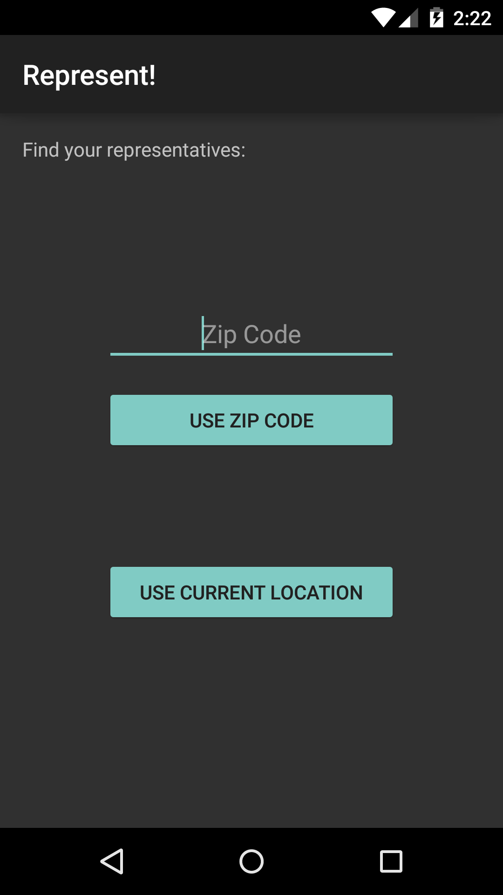
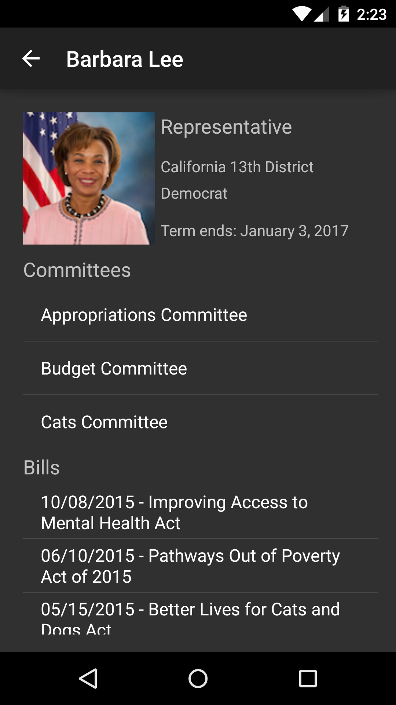

# PROG 02: Represent!

On the mobile app, input a zip code or use your current location to see the senators and representatives of that area. Simultaneously, scrollable cards showing the senators and representatives will show on the watch. On the mobile app, click on the More Info button to see more details about them.

## Authors

Kathy Liang ([kathyyliang@berkeley.edu](mailto:kathyyliang@berkeley.edu))

## Demo Video

See [prog02-b] (https://youtu.be/Wlqhx_Ku-yg)

## Screenshots

## Acknowledgments

* Catnip
* http://developer.android.com/develop/index.html
* http://developer.android.com/reference/packages.html
* http://developer.android.com/samples/GridViewPager/src/com.example.android.wearable.gridviewpager/CustomFragment.html
